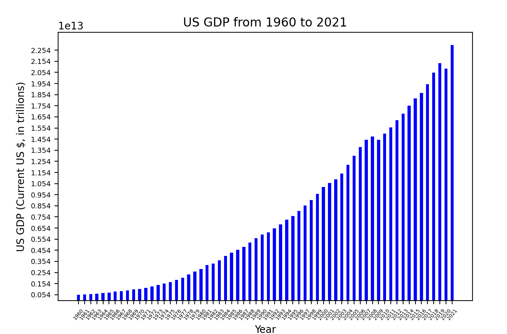
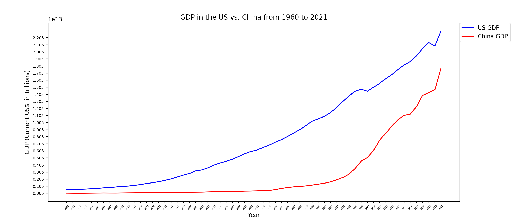

# GDP in the US and China

For Project 2 - Visualizing Interesting Datasets - I looked at Nominal Gross Domestic Product (GDP) in the US and China from 1960 to 2021. Nominal GDP is the value of economic output in current prices - hence the data is measured by current US dollars. I first focused on GDP in the US over the 62 year time period, then compared the GDP of US and China together. 

This was completed for my CS40 - Computing for the Web - course. Project instructions found [here](https://github.com/mikeizbicki/cmc-csci040/tree/2022fall/project_02)

## GDP Data

The graphs displayed below use data from **The World Bank**. 

### **US Nominal GDP from 1960 to 2021**

This bar chart illustrates Nominal GDP (current US dollars) in the United States from 1960 to 2021. Since the level of GDP is so large, I have plotted it in the trillions to make the data more readable. Here, we can see exponential growth of Nominal GDP in the US over time. 

*This data was found through [this Github](https://github.com/jdorfman/awesome-json-datasets#gdp). Specifically, from the json file of GDP in the US found through [The World Bank](http://api.worldbank.org/v2/countries/USA/indicators/NY.GDP.MKTP.CD?per_page=5000&format=json)*

### **GDP in the US vs. China from 1960 to 2021**

Here, we have a line plot of Nominal GDP in the US and China from 1960 to 2021. Both data sets are measured in current US dollars, so they are comparable values. From this plot, we can observe that while China's nominal GDP is less than the US's nominal GDP, China's nominal GDP appears to be growing faster. This observation matches the hypothesis of many economists that China's economy could surpass that of the US. However, a more accurate indicator of the health of the US's and China's economy would be per capita income, or Real GDP per person. That comparison will be for another day. 

*The data for this model was from [The World Bank](https://data.worldbank.org/country/china?view=chart). I downloaded a large csv file and extracted the row with China's GDP in current US dollars. The data for the US line plot is from the [json file](http://api.worldbank.org/v2/countries/USA/indicators/NY.GDP.MKTP.CD?per_page=5000&format=json) plotted previously.*
